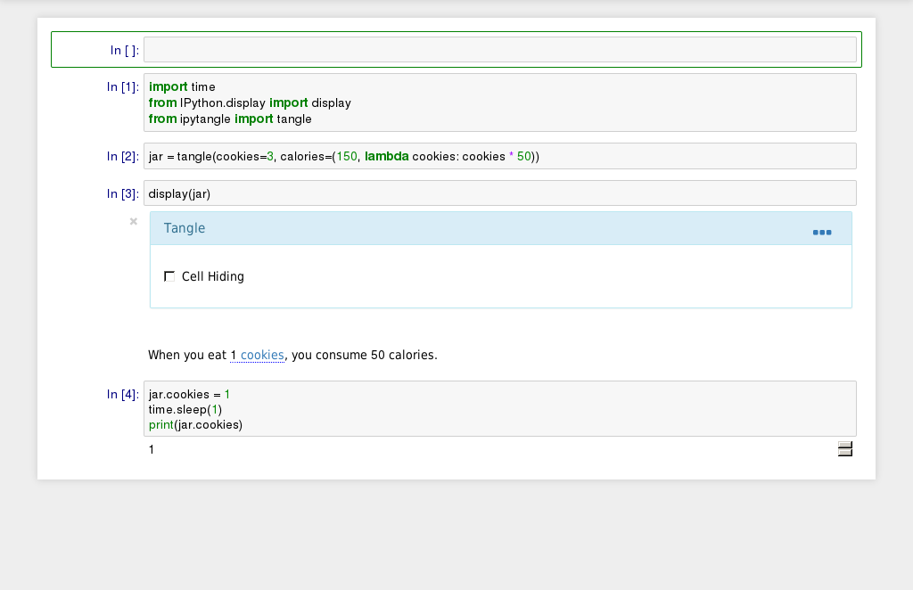

# IPyTangle 

[![build-badge][]][build] [![pypi-badge][]][pypi]

Reactive narratives inspired by [Tangle][] in the [Jupyter Notebook][].

IPyTangle makes plain markdown into an interactive part of your data-driven narrative.

[build]: https://travis-ci.org/bollwyvl/ipytangle
[build-badge]: https://travis-ci.org/bollwyvl/ipytangle.svg
[pypi]: https://pypi.python.org/pypi/ipytangle/
[pypi-badge]: https://img.shields.io/pypi/v/ipytangle.svg
[Tangle]: http://worrydream.com/Tangle/
[Jupyter Notebook]: http://jupyter.org



## Installation
Get the most recent release with:

```bash
pip install ipytangle
```

Or the bleeding-edge version:
```bash
pip install -e git+https://github.com/bollwyvl/ipytangle#egg=IPyTangle
```

## Usage

In a Notebook, write this python...

```python
from ipytangle import tangle

tangle(cookies=3, calories=lambda cookies: cookies * 50)
```

And this markdown:

```markdown
When you eat [`cookies` cookies](#:cookies), you consume [`calories` calories](#:calories).
```

And you would see something like this:

> When you eat [`2` cookies](#:cookies), you consume [`150` calories](#:).

And interacting with the links would cause the result to update.

## Examples
Adapted from the originals from [Tangle](http://worrydream.com/Tangle/).

- [Cookies](notebooks/examples/Cookies.ipynb)
- [California State Parks Proposition 21](notebooks/examples/Proposition 21.ipynb)

Additionally, `ipytangle` comes with integration with IPython's `interact`, the easiest way to start using widgets.

- [`Interact`ing with a tangle](notebooks/examples/Interacting with a tangle.ipynb)
- [Tangling up `interact`](notebooks/examples/Tangling up interact.ipynb)

## Markdown
`ipytangle` implements most of the [TangleKit](https://github.com/worrydream/Tangle/blob/master/TangleKit/TangleKit.js) baseline as markdown links. Because it adds no new notation, unrendered Tangle Markdown should still render in a useful way.

Generally, think of a link as:
```markdown
[what the user sees](#:tangle types)
```

In the link text, backticks, **\`\`** are used to represent a JavaScript expression that will be updated on user interaction, cascading updates, or other updates from the kernel. In addition to any variables defined with `ipytangle`, some [formatting](#Formatting) libraries are provided. `window` globals should also work :wink:.

Only the generated `code` blocks will be transformed, the rest of the elements (if any) will be preserved. This means you can use images, inside the label of a control, for example.

### Link Types

#### `[<stringy expression>](#:)`
just display a view

```markdown
For [`years` years](#:) have I trained Jedi. 
```

####`[<stringy expression>](#:<variable>)`
display a view and update an integer based on dragging

```markdown
[made the kessel run in `distance` parsecs](#:distance)
```

#### `[<booly expression>](#:if)` ... _[_ `[<booly expression>](#elif)`_]_ ... _[_ `[](#:else)` _]_ ... `[](#:endif)`
mark some text (which may have other fields) to only display based on condition
```markdown
What's more foolish? The [`fool_is_more_foolish`](#:if)fool[](#:else)the fool who follows him(#:endif).
```
you may also have an `else` and any number of `elif`s... because they are markdown span-level elements, you may use 
newlines for easier editing
```markdown
[`feeling == "bad"`](#:if) I have a bad feeling about this.
[`feeling == "cautious"`](#:elif) You will never find a more wretched hive of scum and villainy.
[](#:else) Search your feelings.
[](#:endif)
```

### Proposed Link Types

#### `[<stringy expression>](#:<variable>:(int|float):<min>:<max>:<step>)`
display a view and update some `type` of variable. Additionally, `min`imum `max`imum and `step`-size values can be specified.

#### `[](#:<variable>:inline)`
Replace the `variable`, for which a linked widget has been registered (TBD) with the widget itself inline. 
> Needs research.

### Widgets
At it's core, `ipytangle` provides `Tangle`, an IPython `Widget`. Because of this, a `Tangle` can connect to any other IPython widgets via _traitlets_ and `links`. Unlike many widgets, a `Tangle` doesn't do much with its screen real estate, and might not be very interesting to put inside a layout. Yet.

There are several methods for creating a `Tangle`.

#### `ipytangle.tangle`
As in the above example, this tries to be the most pythonic approach.


    from ipytangle import tangle
    
    square = tangle(x=1, y=(1, lambda x: x*x))
    
    print("square is", square)
    square.x = 2
    print("y is", square.y)

    square is <IPython.utils.traitlets.DynamicAutoTangle139717235746760 object at 0x7f1274347ef0>
    y is 4


##### Linking to other widgets
`tangle` makes working with other core and custom widgets easy, automatically copying trait information. If a widget implements `value`, as most of the core widgets do, you can reference it directly. Alternately, specify a `tuple` of `(widget, "trait_name")` to subscribe to that trait.


    from IPython.html.widgets import IntSlider
    
    x = IntSlider(1)
    square = tangle(x=x,  y=(1, lambda x: x*x))
    
    print("square is", square)
    x.value = 2
    print("y is", square.y)

    square is <IPython.utils.traitlets.DynamicAutoTangle139717235839048 object at 0x7f1274362080>
    y is 4


#### `ipytangle.Tangle`
If you are already familiar with widgets, subclassing `Tangle` might be the most convenient:


    from ipytangle import Tangle
    from IPython.utils import traitlets
    
    class Square(Tangle):
        x = traitlets.CInt(1, sync=True)
        y = traitlets.CInt(1, sync=True)
        
        def _x_changed(self):
            self.y = self.x * self.x
    
    square = Square()
    
    print("square is", square)
    square.x = 2
    print("y is", square.y)

    square is <__main__.Square object at 0x7f127434b7f0>
    y is 4


> _A future version of IPython Widgets will allow dynamically-added traits with `add_trait`. This will open up whole new areas for tinkering. Stay tuned!_

### Formatting
In addition to your locally-bound variables, `ipytangle` bundles several nice JavaScript libraries and shortcuts for formatting text and numbers:
- [`moment`](http://momentjs.com/) dates and times
- [`mathjs`](http://mathjs.org/) scientific units`
- [`numeral`](http://numeraljs.com/) currency, and miscellany

## Inspiration
Of course, Brett Victor's [Tangle](http://worrydream.com/Tangle/) is the primary inspiration, as well as:
- [tributary](http://tributary.io/)
- [derby](http://derbjys.org)
- [d3](http://d3js.org)

## Roadmap
- support [TangleKit](https://github.com/worrydream/Tangle/blob/master/TangleKit/TangleKit.js) baseline
  - float
  - switch
- $L_AT^EX$ (sic)
- sparklines, distributions, etc.
- offline/nbviewer?
